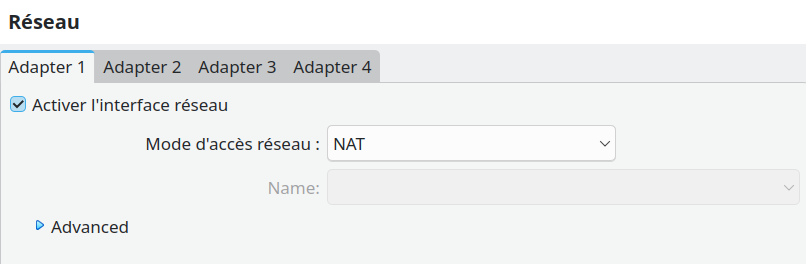
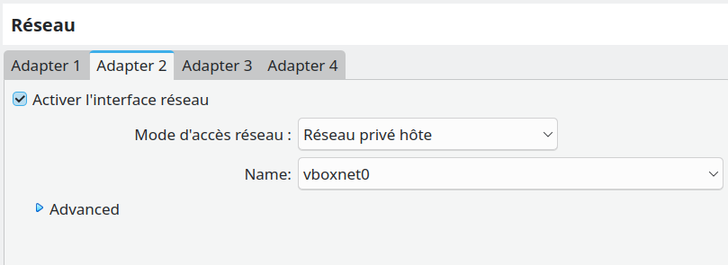
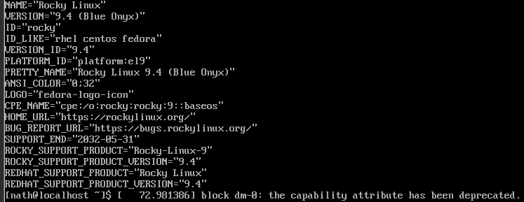
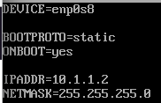
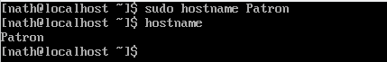

# Sujet réseau


# Partie 1 : Setup du patron

🌞 Créez une VM avec VirtualBox, nommée Patron


🌞 Configurez la VM avec 2 interfaces réseaux. La première en NAT et la deuxième en Host-Only.

La première en NAT :



La seconde en Host_Only :




🌞 Installez Rocky Linux minimal sur la VM.

```
cat /etc/os-release
```


🌞 Définissez une IP statique à la VM.


```
sudo nano /etc/sysconfig/network-scripts/ifcfg-enp0s8

```



🌞 Donnez un hostname à la machine.

pour lui donner un hostname
```
sudo hostname
```

pour verifier le hostname de la machine
```
hostname
```

